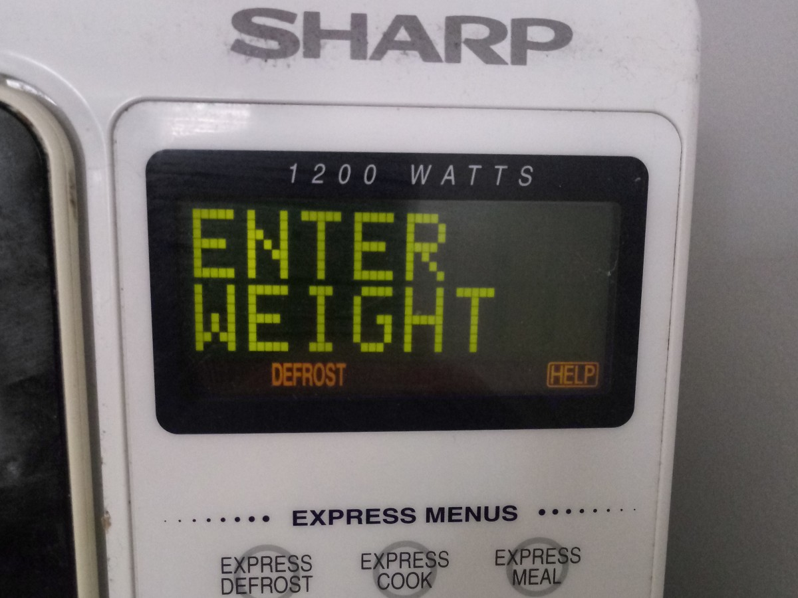

# Libre Dot Matrix

[![][Fontbakery]](https://FriedOrange.github.io/Libre-Dot-Matrix/fontbakery/fontbakery-report.html)
[![][Universal]](https://FriedOrange.github.io/Libre-Dot-Matrix/fontbakery/fontbakery-report.html)
[![][GF Profile]](https://FriedOrange.github.io/Libre-Dot-Matrix/fontbakery/fontbakery-report.html)
[![][Outline Correctness]](https://FriedOrange.github.io/Libre-Dot-Matrix/fontbakery/fontbakery-report.html)
[![][Shaping]](https://FriedOrange.github.io/Libre-Dot-Matrix/fontbakery/fontbakery-report.html)

[Fontbakery]: https://img.shields.io/endpoint?url=https%3A%2F%2Fraw.githubusercontent.com%2FFriedOrange%2FLibre-Dot-Matrix%2Fgh-pages%2Fbadges%2Foverall.json
[GF Profile]: https://img.shields.io/endpoint?url=https%3A%2F%2Fraw.githubusercontent.com%2FFriedOrange%2FLibre-Dot-Matrix%2Fgh-pages%2Fbadges%2FGoogleFonts.json
[Outline Correctness]: https://img.shields.io/endpoint?url=https%3A%2F%2Fraw.githubusercontent.com%2FFriedOrange%2FLibre-Dot-Matrix%2Fgh-pages%2Fbadges%2FOutlineCorrectnessChecks.json
[Shaping]: https://img.shields.io/endpoint?url=https%3A%2F%2Fraw.githubusercontent.com%2FFriedOrange%2FLibre-Dot-Matrix%2Fgh-pages%2Fbadges%2FShapingChecks.json
[Universal]: https://img.shields.io/endpoint?url=https%3A%2F%2Fraw.githubusercontent.com%2FFriedOrange%2FLibre-Dot-Matrix%2Fgh-pages%2Fbadges%2FUniversal.json

This is set of pixelated, retro-style fonts based on the classic 5&times;7 dot matrix capitals. There are four variants:

* **Regular** is like most &ldquo;pixel&rdquo; fonts that use connected, square dots, like the displays of 8-bit home computers and video game consoles from the 1980s.
* **Print** is made up of separate circular dots, resembling the output of a dot-matrix printer or the expiry dates on food products. It also mimics the electronic signs found on motorways, at airports and train stations, etc.
* **Screen** is a similar effect to Print, but uses square dots instead. It matches the look of the &ldquo;character LCDs&rdquo; seen in many devices, as well as some light-up LED displays.
* **Video** is an interpolated version of Regular. It resembles the on-screen displays of VCRs, Teletext, camcorders and the like; harking back to the early days of computerisation in television and home video.

### Inspiration

For much of my life, I have liked both alphabets and lettering, and 8-bit home computers and video games. The intersection of those interests is low-resolution dot matrix graphics and fonts, which remain perhaps the most iconic feature of the 8-bit systems. Fonts based on a 5&times;7 dot matrix are especially noteworthy, having been some of the most common dimensions for over half a century.

In utilitarian applications, 5&times;7 dot matrix fonts may still be found all around us, for example: in calculators, microwave ovens, electronic road signs, train stations and airport terminals, dot-matrix printers (which have mostly fallen out of use, but the style is still commonly seen in the best before or use by dates printed on food packaging) and &ldquo;character LCD&rdquo; modules used in all manner of electronic devices:

|  |  |  |
| --- | --- | --- |
|  |  |  |

So-called &ldquo;pixel&rdquo; fonts are also a popular stylistic choice, often seen in contexts that have nothing to do with electronics or games, even in the absence of technical limitations. I have been disappointed by some existing computer fonts in this style, however; many contain unusual, ugly or unrealistic designs, and most have only a small character set.

With all of that in mind, I felt that the typographical world could be enriched through the creation of high-quality, open-source fonts in this ubiquitous style. My idea was to incorporate the best features from historical fonts while avoiding some of the oddities and ugliness often found in them.

Much of my interest in this topic was boosted by Damien Guard’s article, [*Typography in 8 bits: system fonts*](https://damieng.com/blog/2011/02/20/typography-in-8-bits-system-fonts). In preparation for this project, I decided to conduct a more comprehensive study of classic dot-matrix fonts, with a focus on those using the iconic 5&times;7 dot matrix capitals.

## Research

**TODO**

## Building

Fonts are built automatically (from the intermediate UFO sources) by GitHub Actions - take a look in the "Actions" tab for the latest build.

### Building manually

Ensure the following programs are installed and added to your PATH environment variable: [Python](https://www.python.org/downloads/), [gftools](https://github.com/googlefonts/gftools), [Fontbakery](https://github.com/googlefonts/fontbakery).

To build the fonts manually on Windows:

* Run `build.bat` in the `sources` folder. 

To build the fonts manually on Linux/macOS:

* Run `build.sh` in the `sources` folder (not tested).

### Modifying the fonts

The master source file, `Libre-Dot-Matrix.sfd`, is in FontForge&rsquo;s SFD format. It is recommended to edit this file if you wish to modify the fonts. Then, re-generate the UFO sources by running `step2.bat`.

To easily add or modify glyphs (requires [FontForge](https://fontforge.org/)):

* Edit the image `glyphs.pbm`
* Set the corresponding codepoints (or glyph names, for unencoded glyphs) in `glyphs.csv`
* Run `step1.bat`, which generates a temporary font containing the new glyphs. 
* Copy the new glyphs into the master source file, `Libre-Dot-Matrix.sfd`, for manual editing as required.

## Changelog

The font is currently in early development. This changelog will be updated once releases are made.

[Font Versioning](https://github.com/googlefonts/gf-docs/tree/main/Spec#font-versioning) is based on semver.

## License

This Font Software is licensed under the SIL Open Font License, Version 1.1.
This license is available with a FAQ at
https://scripts.sil.org/OFL