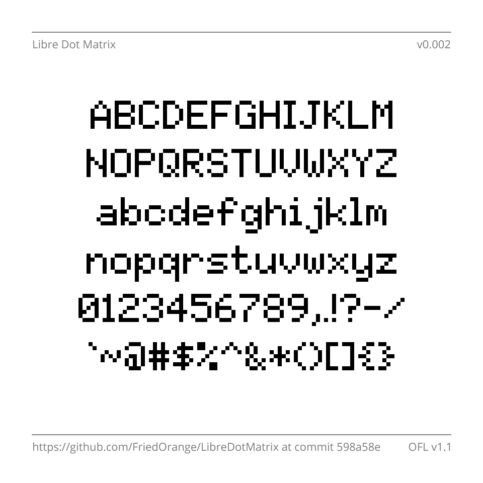
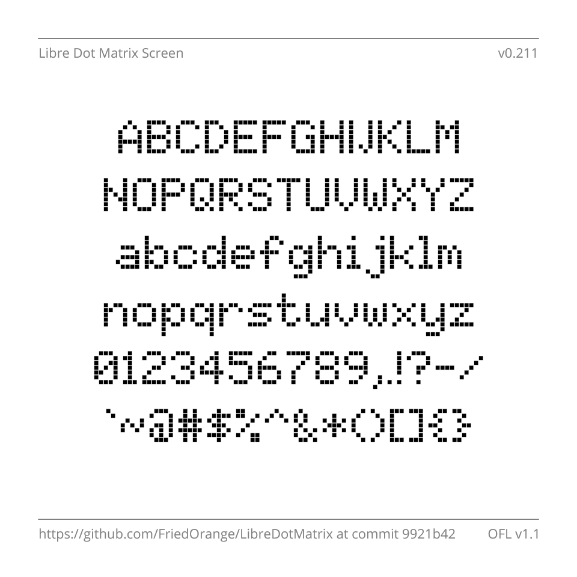
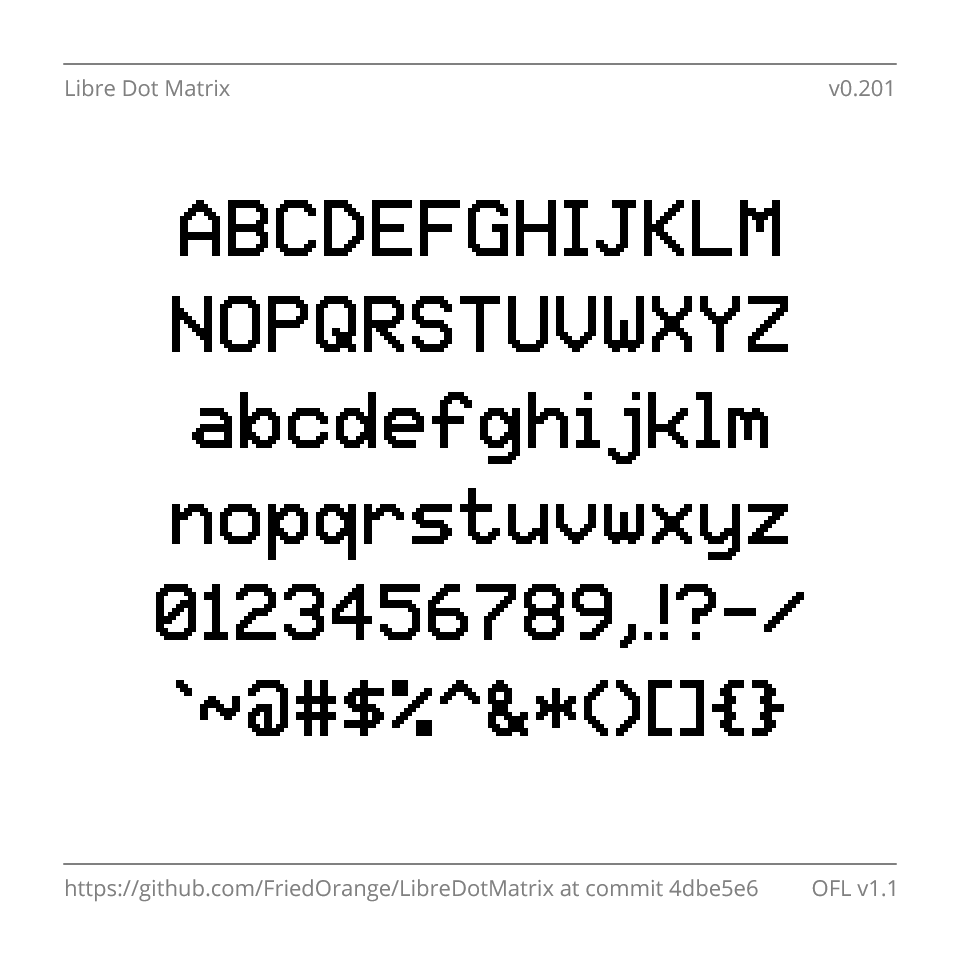

# Matrix Sans

This is set of pixelated, retro-style fonts based on the classic 5&times;7 dot matrix capitals. The design captures the look of this ubiquitous format, incorporating the best features from historical examples. There are five variants in this family:

- **Regular** is like most "pixel" fonts that use connected, square dots, like the displays of 8-bit home computers and video game consoles from the 1980s.
- **Print** is made up of separate circular dots, resembling the output of a dot-matrix printer or the expiry dates on food products. It also mimics the electronic signs found on motorways, at airports and train stations, etc.
- **Raster** consists of horizontal lines with rounded edges, emulating a *raster*; the set of lines traced out by the electron beam in a CRT, as seen in old computer monitors.
- **Screen** is similar to Print, but uses square dots instead of round ones. It matches the look of the "character LCDs" seen in many devices, as well as some light-up LED displays.
- **Video** is an interpolated version of Regular. It resembles the on-screen displays of VCRs, Teletext, camcorders and the like; harking back to the early days of computerisation in television and home video.

### Links

- [**Downloads**](https://github.com/FriedOrange/MatrixSans/releases)
- [**Features & Design philosopy**](https://friedorange.github.io/MatrixSans/)
- [**Tests & Demos**](https://friedorange.github.io/MatrixSans/tests.html)
- [**Background/Inspiration**](https://friedorange.github.io/MatrixSans/inspiration.html)
- [**Research** (with comments on 40+ existing designs)](https://friedorange.github.io/MatrixSans/research.html)

### Sample images

## Building

Fonts are built automatically by GitHub Actions - see the "Actions" tab for the latest build.

### Building manually

Ensure the following programs are installed: 

- [Python](https://www.python.org/downloads/), for running the following items
- [sfdLib](https://github.com/MFEK/sfdLib.py), for generating the UFO sources (see below)
- [gftools](https://github.com/googlefonts/gftools), for building the fonts from the intermediate UFO sources
- [drawbot-skia](https://github.com/justvanrossum/drawbot-skia), for producing the sample images in the `documentation` folder (optional)
- [Font Bakery](https://github.com/googlefonts/fontbakery/), for testing the fonts (run `test.bat`) (optional)

After installing Python (and ensuring it is added to the PATH environment variable), the others may be acquired automatically by running `pip install -r requirements.txt` at the command line.

To build the fonts:

- On Windows, run `build.bat` at the command line
- On Linux, macOS etc, run `make build` at the command line (terminal)

### Modifying the fonts

The master source file, `MatrixSans_MASTER.sfd`, is in FontForge's SFD format. It is recommended to edit this file if you wish to modify the fonts. Then, re-generate the intermediate UFO sources by running `step2.bat`. Note that the batch files (`.bat`) are designed to run in the Windows Command Prompt; they may need to be rewritten to work on Linux, macOS etc.

To easily add or modify glyphs (requires [FontForge](https://fontforge.org/)):

- Edit the image `glyphs.pbm`
- Set the corresponding glyph names in `glyphs.csv`
- Run `step1.bat` to generate a temporary font `temp.sfd` containing the new glyphs
- Using FontForge, copy the new glyphs into the master source file, `MatrixSans_MASTER.sfd`
- Run `step2.bat` to generate the intermediate UFO sources in the various styles
	- Custom behaviour is implemented for certain glyphs in the Video and Raster styles; edit `step2.py` to change this

## Changelog

#### 30 December 2024 - Version 1.512

- Restored previous *tj* kerning pairs
- Increased side bearings (spacing) of horizontal bar/quote dash: ―

#### 28 December 2024 - Version 1.511

- Improved appearance of service mark and trademark signs in Video style

#### 28 December 2024 - Version 1.510

- Now supports the [World Glyph Set](https://en.wikipedia.org/wiki/World_glyph_set) and the alphabetic glyphs of [Windows Glyph List 4](https://learn.microsoft.com/en-us/typography/develop/wgl4)
- Fixed placement of Greek tonos mark
- Fixed placement of circumflex accent in ộ
- Changed designs of pilcrow, section, daggers, ruble, service mark and trademark signs ¶ § † ‡ ₽ ℠ ™
- Rewrote the kern feature for Latin glyphs; many more pairs are now kerned
- Changed underline thickness in Print, Raster and Screen styles
- Improved appearance of some glyphs in Video style
- Added Stylistic Alternates (salt) OpenType feature, providing another way to access existing alternate glyphs

#### 17 December 2024 - Version 1.500

- Now supports [Google Fonts Greek Core](https://github.com/googlefonts/glyphsets/blob/main/GLYPHSETS.md#gf-greek-core) and [Adobe Greek 1](http://adobe-type-tools.github.io/adobe-greek-charsets/adobe-greek-1.html) character sets
  - Alternate form of Greek letter φ (ϕ) available via Stylistic Set 3
- Fixed missing Cyrillic small cap "е"
- Improved kerning for Cyrillic

#### 15 December 2024 - Version 1.401

- Improved kerning for Cyrillic
- Made Ғ and ғ narrower

#### 14 December 2024 - Version 1.400

- Now supports [Google Fonts Cyrillic Core](https://github.com/googlefonts/glyphsets/blob/main/GLYPHSETS.md#gf-cyrillic-core) and [Adobe Cyrillic 1](http://adobe-type-tools.github.io/adobe-cyrillic-charsets/adobe-cyrillic-1.html) character sets
- Improved kerning

#### 11 December 2024 - Version 1.300

- Now supports Google Fonts Latin PriAfrican, TransLatin Arabic and TransLatin Pinyin character sets
- Changed designs of: Ŋ ŋ ƒ Ħ
- Made alternate form of Ŋ accessible by `ss02` OpenType feature

#### 10 December 2024 - Version 1.210

- Improved appearance of various glyphs in Video style
- Added media control symbols ⏏︎ ⏩︎ ⏪︎ ▶︎ ⏸︎ ⏹︎ ⏺︎
- Added alternate glyphs for 6 and 9, accessed by `ss01` OpenType feature (swapped with normal glyphs in Video style)
- Fixed a visual glitch with the combining hook above glyph ◌̉

#### 9 December 2024 - Version 1.200

- Now supports Adobe Latin 4 and Google Fonts Latin Core/Vietnamese/Plus character sets
- Each style now has an "SC" (small capitals) variant
- Changed design of ¶, ƒ, ™, and • ◦
- Added `aalt`, `numr`, `dnom`, `frac`, `sups` and `subs` OpenType features

#### 26 December 2022 - Version 1.100

- Added small capitals, accessible through the `smcp` and `c2sc` Opentype features
- Changed the design of Æ, æ, Œ, œ, Ð, đ, ħ, ƒ, and ₽ 
- Improved appearance of "M" in Video style
- Improved kerning

#### 19 December 2022 - Version 1.000
- Updated kerning
- Reduced space width
- Removed unnecessary space characters
- Updated strikeout width and position in Print, Raster and Screen styles
- Reduced dot size in Screen style

#### 14 December 2022 - Version 0.301
- Improved appearance of em dash, underscore, cedilla and ogonek in Raster style
- Added `meta` table to exported fonts, specifying designed/supported script
- Reduced number of contours in Regular style, by disabling Fontmake's overlap removal
- Removed ttfautohint from the build process
- Changed font names to meet Google Fonts requirements

#### 9 December 2022 - Version 0.300
- Added Raster style

#### 7 December 2022 - Version 0.216
- Improved kerning
- Changed appearance of alternative caron diacritic

#### 25 November 2022 - Version 0.215
- Improved Video style appearance
- Added additional whitespace and hyphen characters
- Fixed alignment of double acute accents
- Changed copyright and registered signs
- Updated font names
- Removed unreachable glyphs (which only existed to placate an older version of Font Bakery)
- Added Greek Delta and mu as references to existing glyphs
- Changed @ sign

#### 15 August 2022 - Version 0.214
- Added kerning

#### 5 August 2022 - Version 0.213
- Changed the working title from "Libre Dot Matrix" to "Matrix Sans"
- Improved the appearance of some characters in the Video style

#### 3 August 2022 - Version 0.212
- Fixed accent placement on Ű and ű
- Increased line height
- Fixed underline position
- Added mark glyph class to the GDEF table to fix Font Bakery warning
- Fixed dot positioning in Screen style
- Increased height of dagger and double dagger

#### 31 July 2022 - Version 0.211
- Changed build process to work around several bugs in FontForge
- The Localised Forms (`locl`) OpenType feature now works correctly

#### 28 July 2022 - Version 0.210
- Modified Dutch ij ligature
- Modified capital letter Ŋ; added localised form for Northern Sami
- Added unencoded glyphs from Google Fonts Latin Core to avoid Font Bakery error (temporary)
- Added OpenType features: `ccmp`, `mark`, `locl`, `tnum`, `zero`

#### 25 July 2022 - Version 0.200
- Now supports [Google Fonts Latin Core](https://github.com/googlefonts/glyphsets/blob/main/GF_glyphsets/Latin/nam/GF_Latin_Core.nam) and [Adobe Latin 3](http://adobe-type-tools.github.io/adobe-latin-charsets/adobe-latin-3.html)
- Added dotted circle (U+25CC)
- Fixed soft hyphen
- Fixed WinAscent metric

#### 23 July 2022 - Version 0.100
- Now supports the [Adobe Latin 2](http://adobe-type-tools.github.io/adobe-latin-charsets/adobe-latin-2.html) character set
- Fixed character widths

#### 21 July 2022 - Version 0.002
- Improved Video style appearance
- Lengthened hyphen by one dot
- Fixed character widths
- Fixed line height
- Updated metadata: font names, PANOSE classification, etc.

#### 20 July 2022 - Version 0.001
- Initial test release
- Supports Basic Latin (ASCII)

## License

This Font Software is licensed under the SIL Open Font License, Version 1.1.
This license is available with a FAQ at
https://scripts.sil.org/OFL