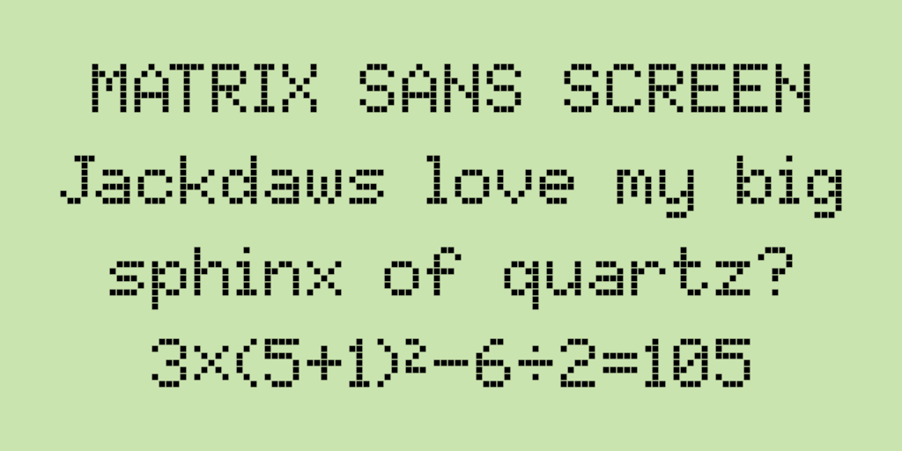

# Libre Dot Matrix

[![][Fontbakery]](https://FriedOrange.github.io/LibreDotMatrix/fontbakery/fontbakery-report.html)
[![][Universal]](https://FriedOrange.github.io/LibreDotMatrix/fontbakery/fontbakery-report.html)
[![][GF Profile]](https://FriedOrange.github.io/LibreDotMatrix/fontbakery/fontbakery-report.html)
[![][Outline Correctness]](https://FriedOrange.github.io/LibreDotMatrix/fontbakery/fontbakery-report.html)
[![][Shaping]](https://FriedOrange.github.io/LibreDotMatrix/fontbakery/fontbakery-report.html)

[Fontbakery]: https://img.shields.io/endpoint?url=https%3A%2F%2Fraw.githubusercontent.com%2FFriedOrange%2FLibreDotMatrix%2Fgh-pages%2Fbadges%2Foverall.json
[GF Profile]: https://img.shields.io/endpoint?url=https%3A%2F%2Fraw.githubusercontent.com%2FFriedOrange%2FLibreDotMatrix%2Fgh-pages%2Fbadges%2FGoogleFonts.json
[Outline Correctness]: https://img.shields.io/endpoint?url=https%3A%2F%2Fraw.githubusercontent.com%2FFriedOrange%2FLibreDotMatrix%2Fgh-pages%2Fbadges%2FOutlineCorrectnessChecks.json
[Shaping]: https://img.shields.io/endpoint?url=https%3A%2F%2Fraw.githubusercontent.com%2FFriedOrange%2FLibreDotMatrix%2Fgh-pages%2Fbadges%2FShapingChecks.json
[Universal]: https://img.shields.io/endpoint?url=https%3A%2F%2Fraw.githubusercontent.com%2FFriedOrange%2FLibreDotMatrix%2Fgh-pages%2Fbadges%2FUniversal.json

This is set of pixelated, retro-style fonts based on the classic 5×7 dot matrix capitals. The design captures the look of this ubiquitous format, incorporating the best features from historical examples. There are four variants in this family:

- **Regular** is like most "pixel" fonts that use connected, square dots, like the displays of 8-bit home computers and video game consoles from the 1980s.
- **Print** is made up of separate circular dots, resembling the output of a dot-matrix printer or the expiry dates on food products. It also mimics the electronic signs found on motorways, at airports and train stations, etc.
- **Screen** is a similar effect to Print, but uses square dots instead. It matches the look of the "character LCDs" seen in many devices, as well as some light-up LED displays.
- **Video** is an interpolated version of Regular. It resembles the on-screen displays of VCRs, Teletext, camcorders and the like; harking back to the early days of computerisation in television and home video.

<!-- 

 -->

## Design philosophy

When designing the dot-matrix patterns for these fonts, I attempted to strike a balance between the following principles:

- authenticity
- quirkiness
- consistency
- sound design

*Authenticity* and *quirkiness* are often in conflict with *consistency* and *sound design*; the countless historical 5&times;7 fonts contain many unusual-looking (*quirky*) features, which by their nature are often poorly-designed. This is not to mention inconsistency: for example, the shapes of the letters *b*, *d*, *p* and *q* are frequently disharmonious, despite being similar by convention.

In order to retain the essence and charm of existing 5&times;7 fonts, yet rein in their oddities and avoid ugliness, none of these principles can be *fully* embraced. Instead, they serve as a guide while trying to choose the most coherent, well thought-out designs possible for this project.

### Research

Much of my interest in the topic was piqued by Damien Guard’s article, [*Typography in 8 bits: system fonts*](https://damieng.com/blog/2011/02/20/typography-in-8-bits-system-fonts). In preparation for this project, I decided to conduct an even more comprehensive study of classic dot-matrix fonts, with a focus on those using the iconic 5&times;7 dot matrix capitals.

See [documentation/research.md](documentation/research.md) for detailed documentation of this study and the decision-making process for the design of this font.

### Proportional spacing

Readers today expect visually consistent spacing around all characters, including narrow ones like *1 I i l* and punctuation marks. Trading some *authenticity* for *sound design*, this font family is proportionally spaced, unlike most prior 5&times;7 fonts. The proportionally-spaced typefaces [American Typewriter](https://www.fonts.com/font/itc/itc-american-typewriter) and [OCR A Tribute](https://www.fonts.com/font/linotype/ocr-a-tribute) are similarly inspired by classic monospaced designs, but take the further step of tweaking the proportions of the glyphs themselves, in the pursuit of a more conventional reading experience. This design doesn't go that far: all glyphs (and spaces between them) are still based strictly on a square grid. Where possible, glyphs have been kept to no more than 5 dots wide, which would allow for a monospaced version to be created with mostly the same glyphs.

## Background

For much of my life, I have liked both alphabets and lettering, and 8-bit home computers and video games. The intersection of those interests is low-resolution dot matrix graphics and fonts, which remain perhaps the most iconic feature of the 8-bit systems. Fonts based on a 5&times;7 dot matrix are especially noteworthy, having been some of the most common dimensions for over half a century.

In utilitarian applications, 5&times;7 dot matrix fonts may still be found all around us, for example: in calculators, microwave ovens, electronic road signs, train stations and airport terminals, dot-matrix printers (which have mostly fallen out of use, but the style is still commonly seen in the expiry dates printed on food packaging) and "character LCD" modules used in all manner of electronic devices:

|  |  |  |
| --- | --- | --- |
|  |  |  |

So-called "pixel" fonts are also a popular stylistic choice, often seen in contexts that have nothing to do with electronics or games, even in the absence of technical limitations. I have been disappointed by some existing computer fonts in this style, however; many contain unusual, ugly or unrealistic designs, and most have only a small character set.

With all of that in mind, I felt that the typographical world could be enriched through the creation of high-quality, open-source fonts in this style.

## Building

Fonts are built automatically by GitHub Actions - see the "Actions" tab for the latest build.

### Building manually

Ensure the following programs are installed and added to your PATH environment variable: [Python](https://www.python.org/downloads/), [gftools](https://github.com/googlefonts/gftools).

To build the fonts manually on Windows:

- Run `build.bat` in the `sources` folder. 

To build the fonts manually on Linux/macOS:

- From the `sources` folder, run the command `gftools builder config.yaml` (not tested).

### Modifying the fonts

The master source file, `LibreDotMatrix.sfd`, is in FontForge's SFD format. It is recommended to edit this file if you wish to modify the fonts. Then, re-generate the intermediate UFO sources by running `step2.bat`.

To easily add or modify glyphs (requires [FontForge](https://fontforge.org/)):

- Edit the image `glyphs.pbm`
- Set the corresponding codepoints (or glyph names, for unencoded glyphs) in `glyphs.csv`
- Run `step1.bat`, which generates a temporary font containing the new glyphs. 
- Copy the new glyphs into the master source file, `LibreDotMatrix.sfd`, for manual editing as required.

## Changelog

The fonts are currently in early development; significant changes may still occur before the release of Version 1.0.

20 July 2022 - Version 0.001
- Initial release
- Supports Basic Latin (ASCII)

[Font Versioning](https://github.com/googlefonts/gf-docs/tree/main/Spec#font-versioning) is based on semver.

## License

This Font Software is licensed under the SIL Open Font License, Version 1.1.
This license is available with a FAQ at
https://scripts.sil.org/OFL