<!DOCTYPE html>
<html lang="en">

<head>
<meta charset="UTF-8">
<meta name="author" content="Brad Neil">
<meta name="viewport" content="width=device-width, initial-scale=1.0">
</head>

<body>

<h1>Research</h1>

These example fonts are presented in approximate chronological order, ranging from the 1960s to the present day. This list is by no means exhaustive; it simply contains all the examples I could find.

Many of the fonts depicted below contained a full set of 128 or 256 characters, including special glyphs for <a href="https://en.wikipedia.org/wiki/Semigraphics">pseudo-graphics</a> applications, other scripts, etc. So as to compare the glyph designs themselves rather than the character sets, only the standard <a href="https://en.wikipedia.org/wiki/ASCII">ASCII</a> ranges of each font are reproduced here (equivalent to Unicode's <a href="https://www.unicode.org/charts/PDF/U0000.pdf">Basic Latin</a> block). The original systems employed character cells of various sizes, resulting in different spacing between characters and lines. For clarity and consistency, the fonts have been presented here with 7&times;10 dot character cells.

I have arranged my comments on the fonts in PMI format: <i>Plus</i> (pros), <i>Minus</i> (cons) and <i>Interesting</i>. The earlier examples tend to attract more comments not necessarily because they are more idiosyncratic, but because each particular quirk is mentioned here only once. Much more could be written about each font if they were critiqued individually.

<h3>IBM 029 Card Punch</h3>

<i>Reference: <a href="https://www.masswerk.at/misc/card-punch-typography/">Norbert Landsteiner &mdash; Punched Card Typography Explained</a></i>

<i>Font replicating this design: <a href="http://scruss.com/blog/2017/03/21/keypunch029-for-all-your-punched-card-font-needs/">Keypunch029</a> by Stewart C. Russell</i>

The IBM 029, a machine for creating <a href="https://en.wikipedia.org/wiki/Punched_card">punched cards</a>, was introduced in 1964 to replace the 026 Printing Card Punch from 1949. I decided to show the 029 character set here because it could print a few more characters than the 026. They are the two oldest dot-matrix character sets I have found in my research. They are so old, in fact, that the patterns were stored on a metal &ldquo;code plate&rdquo; since electronic read-only memories &mdash; indeed, integrated circuits (or silicon chips) in general &mdash; were yet to be invented.

Despite their advanced age, a majority of these glyphs have stood the test of time, appearing the same as newer 5&times;7 dot matrix fonts. There are only a couple of truly unusual designs, like the letter <i>S</i> which was probably chosen to differentiate it from the number <i>5</i>.

	<h4>P</h4>
	<ul>
		<li>Clear, open dollar sign <i>$</i> with small <i>s</i> to allow the strokes to protrude above and below</li>
		<li>Heavy punctuation marks <i>' , . : ; </i> are distinguishable in adverse conditions</li>
		<li>Clear, exaggerated curves of brackets/parentheses <i>( )</i></li>
		<li>Serifs differentiate number <i>1</i> and letter <i>I</i></li>
		<li>High-waisted <i>5</i> is well-differentiated</li>
		<li>Squarish <i>G</i> has good legibility</li>
	</ul>

	<h4>M</h4>
	<ul>
		<li>Wavy diagonals in per cent sign <i>%</i> and <i>X</i></li>
		<li>Heavy apostrophe <i>'</i> is ugly</li>
		<li>Crowded dots in asterisk <i>*</i></li>
		<li>Slightly low hyphen/minus sign <i>-</i></li>
		<li>Semicolon <i>;</i> not aligned with colon <i>:</i></li>
		<li>Narrow question mark <i>?</i></li>
		<li>Serifs on <i>B D</i> help to differentiate from <i>8 O</i>, but inconsistent with the other letters</li>
		<li>Short crossbars on <i>E F</i></li>
		<li>Upper terminal of <i>G</i> does not match <i>C</i></li>
		<li>Serifless <i>J</i> does not match <i>I</i></li>
		<li>High diagonal of <i>N</i></li>
		<li>Diagonal centre of <i>S</i></li>
		<li>Stumpy central peak of <i>W</i></li>
	</ul>

	<h4>I</h4>
	<ul>
		<li>Unusual, decorative number sign <i>#</i></li>
		<li>Dots in <i>%</i>; no room for circles</li>
		<li>Floating diagonal in slash <i>/</i> looks odd today, but a nearly universal choice in 5&times;7 fonts</li>
		<li>Narrow zero <i>0</i> to differentiate from <i>O</i></li>
		<li>Exaggerated lower curve on <i>2</i></li>
		<li>Somewhat awkward diagonal on <i>7</i></li>
		<li>Large less- and greater-than signs <i>&lt; &gt;</i></li>
		<li>At sign <i>@</i> visibly based on <i>a</i>, but loop does not extend all the way around</li>
		<li>Angular <i>A</i></li>
		<li>Somewhat awkward shape of <i>M</i></li>
		<li>Rectangular <i>O</i> to differentiate from zero <i>0</i></li>
		<li>Sharp <i>V</i> is effective but does not match <i>A</i></li>
	</ul>

<h3>Project Intrex</h3>
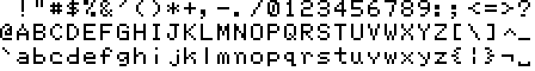

<i>Reference: <a href="https://archive.org/details/ERIC_ED031274/page/n101/mode/2up">Paul Allen King Jr. &mdash; A novel solid state character generator</a></i>

While searching <a href="https://archive.org/">Internet Archive</a> for information, I found a 1969 thesis about the development of a character generator for an automated library system at MIT. This device supplied character patterns for a computerised video display, still quite a novel concept at the time. The dot matrix data were stored in a hand-woven <a href="https://en.wikipedia.org/wiki/Core_rope_memory">core rope memory</a>.

The character set depicted here was actually not intended to be used directly, but instead with interpolation circuitry that smoothed curves and diagonals to produce a 9&times;13 dot matrix. As such, many of the designs are unconventional or suboptimal in appearance in their 5&times;7 form.

	<h4>P</h4>
	<ul>
		<li>Full-height stroke in dollar sign <i>$</i></li>
		<li>Effective six-pointed asterisk <i>*</i></li>
		<li>Semicolon <i>;</i> and colon <i>:</i> properly aligned</li>
		<li>5&times;5 less- and greater-than signs <i>&lt; &gt;</i> (albeit with wavy diagonals)</li>
		<li>Exaggerated curve of <i>D</i> differentiates from <i>O</i></li>
		<li>Serifs on <i>J</i> harmonise well with <i>I</i></li>
		<li>Conventional design of <i>S</i></li>
		<li>Effective, if oversized, grave accent <i>`</i></li>
		<li>Attractive <i>f</i> uses full width, but low crossbar</li>
		<li>Highly exaggerated curly brackets/braces <i>{ }</i> very effective and well-differentiated</li>
	</ul>

	<h4>M</h4>
	<ul>
		<li>Asymmetrical slash in per cent sign <i>%</i></li>
		<li>Apostrophe <i>'</i> resembles prime mark; would not work as opening quotation mark</li>
		<li>Full-height slashes <i>/ \</i> leading to lumpy diagonals</li>
		<li>Poorly-executed slashed zero <i>0</i></li>
		<li>Elongated central terminal of <i>3</i></li>
		<li>Top-heavy <i>5</i></li>
		<li>Tails of <i>6</i> and <i>9</i> too long</li>
		<li>Poorly-executed question mark <i>?</i></li>
		<li>Uneven at sign <i>@</i></li>
		<li>Pointy <i>A v</i></li>
		<li>Uneven weight in diagonals of <i>M N</i></li>
		<li>Reduced <a href="https://en.wikipedia.org/wiki/X-height">x-height</a> of <i>b d</i></li>
		<li>Bowl of <i>g</i> does not match <i>b d p q</i></li>
		<li>Dot of <i>i</i> higher than that of <i>j</i></li>
		<li>Serifless <i>l</i> (small <i>L</i>) hard to differentiate</li>
		<li>Rounded <i>m</i> inconsistent with <i>n</i></li>
		<li>Imbalanced <i>y</i></li>
	</ul>

	<h4>I</h4>
	<ul>
		<li>Small number sign <i>#</i></li>
		<li>Large, uneven upper part of ampersand <i>&amp;</i></li>
		<li>Straight lower terminal of <i>5</i></li>
		<li>Straight diagonal of <i>7</i></li>
		<li>Aggressively-rounded <i>C</i> only matches <i>D</i></li>
		<li>Prominent crossbar of <i>G</i></li>
		<li>Very sharp <i>V</i> leads to narrow crotch</li>
		<li>Excellent angular shape of <i>W w</i> but risks looking like a shaded pattern, losing legibility</li>
		<li>Low caret <i>^</i></li>
		<li>Asymmetrical <i>c</i></li>
		<li>Floating <i>g p q</i> with single-dot descenders</li>
		<li>Unusual but effective design of <i>k</i></li>
		<li>Tails of <i>n q r u</i></li>
		<li>Gap in vertical bar <i>|</i></li>
	</ul>

<h3>Texas Instruments TMS4103</h3>
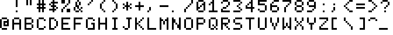

<i>Reference: <a href="http://vtda.org/docs/computing/Centronics/101_101A_101AL_102A_306_SpecificationsInterfaceInformation.pdf">Centronics 101 brochure</a></i>

The TMS4103 was an early <a href="https://www.tinaja.com/glib/rad_elec/mos_character_gens_6_74.pdf">MOS character generator</a>: that is, a special ROM chip containing character bitmaps. These devices were standard parts stocked by their manufacturers, without the need for a custom order as with ROMs in general. The TMS4103 dates back to at least 1970, when it was used in the first dot-matrix printers, the Centronics 101 and DEC LA30 DECwriter (well, I <i>assume</i> it was also used in the 101, since its character set is identical to <a href="https://manx-docs.org/mirror/vt100.net/docs/dec-00-la30-dc.pdf">that of the LA30</a>).

	<h4>P</h4>
	<ul>
		<li>Consistent slashes in <i>% / \</i> (but still ugly)</li>
		<li>Large, clear comma <i>,</i></li>
		<li>Single-dot punctuation marks <i>. : ;</i> look better in running text</li>
		<li>Slashed zero <i>0</i></li>
		<li>Colon <i>:</i> on baseline</li>
		<li>More usual question mark <i>?</i> shape</li>
	</ul>

	<h4>M</h4>
	<ul>
		<li><i>&amp;</i> has flair but slightly uneven weight</li>
		<li>Awkward <i>2</i></li>
		<li>Very awkward <i>3</i></li>
		<li>Narrow semicolon <i>;</i> spacing</li>
		<li>Oddly rounded circumflex <i>^</i></li>
	</ul>

	<h4>I</h4>
	<ul>
		<li>Wide gap in exclamation mark <i>!</i></li>
		<li>Prominent uptick and serifs on <i>1</i></li>
		<li>Extra-large less- and greater-than signs <i>&lt; &gt;</i></li>
		<li>At sign <i>@</i> mostly encircled, but no <i>a</i> visible</li>
		<li>Round-topped <i>A</i></li>
		<li>Horizontal terminals on <i>S</i></li>
		<li><i>W</i> like upside-down <i>M</i> is highly legible</li>
		<li>Rounded <i>Y</i> with centred junction</li>
	</ul>

<h3>Fairchild 3258</h3>
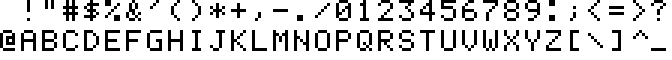

<i>Reference: <a href="http://www.citylan.it/wiki/images/5/58/3258.pdf">3258 datasheet</a></i>

Another character generator from the early 1970s.

	<h4>P</h4>
	<ul>
		<li>Sharp and legible <i>2</i></li>
		<li>Centred diagonal of <i>N</i> looks a bit odd, but is the best design yet in my opinion</li>
	</ul>

	<h4>M</h4>
	<ul>
		<li>Flat-topped <i>3</i> aids differentiation from <i>8</i>, but looks to be missing dots in the centre</li>
		<li>Wide colon <i>:</i> spacing</li>
		<li>Mismatched colon <i>:</i> and semicolon <i>;</i></li>
	</ul>

	<h4>I</h4>
	<ul>
		<li>Tight upper curve of question mark <i>?</i></li>
		<li>Similar at sign <i>@</i> fully encircled</li>
		<li>Straight-sided <i>V</i> (a common choice)</li>
		<li>Round-bottomed <i>W</i> (also popular)</li>
		<li>Lower crotch of <i>Y</i>, shape echoes <i>V</i></li>
	</ul>

<h3>General Instrument RO-5-2240S</h3>
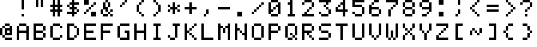

<i>Reference: <a href="https://archive.org/details/bitsavers_gidataBook_42027291/page/276/mode/2up">RO-5-2240S datasheet</a></i>

Yet another character generator. The glyph patterns are similar to those of the Fairchild 3258 above, with only a few differences

	<h4>P</h4>
	<ul>
		<li>Effective design of tilde <i>~</i> (in place of backslash <i>\</i>)</li>
		<li>More subtle curly brackets <i>{ }</i></li>
	</ul>

	<h4>M</h4>
	<ul>
		<li>Aggressively-rounded at sign <i>@</i>; circle touches &ldquo;a&rdquo;</li>
	</ul>

	<h4>I</h4>

<h3>Mostek MK2408P</h3>

<i>Reference: <a href="http://kazojc.com/elementy_czynne/IC/MK2408P.pdf">MK2408P datasheet</a></i>

Still another character generator.

	<h4>P</h4>
	<ul>
		<li>Attractively curved <i>2</i>, a popular style</li>
		<li>Small less- and greater-than signs <i>&lt; &gt;</i> uncommon but very effective</li>
		<li>Round <i>G</i> consistent with other letters</li>
	</ul>

	<h4>M</h4>
	<ul>
		<li>Comma-like design of apostrophe <i>'</i> would not work as an opening quotation mark</li>
		<li>Two-dot commas <i>, ;</i> possibly too subtle</li>
		<li>Upper diagonal of <i>3</i> better, but still ugly</li>
		<li>Top-heavy <i>7</i></li>
		<li>Very abstract at sign <i>@</i></li>
		<li>Diagonals of <i>V</i> look like tapered curves</li>
	</ul>

	<h4>I</h4>
	<ul>
		<li>Interesting (and probably unique) ampersand <i>&amp;</i> design</li>
		<li>Oversized asterisk <i>*</i> (but a common choice)</li>
		<li><i>D</i> matches other curved glyphs, but differs from <i>O</i> by only two dots</li>
		<li>Low crossbar on <i>G</i> carries typographic flair, but looks out of place to my eye</li>
	</ul>

<h3>National Semiconductor MM4240</h3>

<i>Reference: <a href="https://archive.org/details/bitsavers_nationaldaMOSIntegratedCircuits_15188155/page/n277/mode/2up">MM4240 application notes</a></i>

This is a composite of two character sets: those of the MM4240AA (capitals only) and MM4240AE (small letters only) character generators. Like most such devices from the era, the glyphs are strictly confined to the 5&times;7 dot matrix, forcing the descending letters <i>g j p q y</i> to sit high on the baseline.  The designs of the small letters appear to have been influenced by traditional handwriting; note especially <i>a b d e g l p q y</i>.

Apart from the slash <i>/</i> and <i>7</i>, all the characters up to <i>Z</i> are identical to those of the IBM 029. There seems to have been a trend of including a crosshatch graphic in the 0x7F position, also seen in several of the character sets below. This could serve as a blinking cursor on video displays.

	<h4>P</h4>
	<ul>
		<li>Attractive bowl shape of <i>b d g p q</i></li>
		<li>Consistent curves of <i>b d g h n p q r u y</i></li>
		<li>Sophisticated, well-executed <i>k</i></li>
		<li>Well-executed <i>t</i> is balanced, uses full width</li>
		<li><i>v</i> matches <i>V</i></li>
		<li>Centres of <i>m w</i> match</li>
	</ul>

	<h4>M</h4>
	<ul>
		<li>Awkward diagonal on <i>7</i></li>
		<li>Bowls of <i>d g</i> upside-down (<i>d</i> needs a spur, <i>g</i> doesn&rsquo;t; see <a href="https://www.fonts.com/font/monotype/lucida-calligraphy">example</a> of convention)</li>
		<li>Crossbar of <i>f</i> too short, does not match <i>t</i></li>
		<li>Ugly tail of <i>i</i> and hook of <i>j</i></li>
		<li>Rounded corner of <i>q</i></li>
		<li>Narrow curly brackets <i>{ }</i> hard to recognise</li>
		<li>Awkward tilde <i>~</i></li>
	</ul>

	<h4>I</h4>
	<ul>
		<li>Script-style <i>a</i> with tail</li>
		<li>Open <i>c</i> is highly legible but looks wide</li>
		<li>Rounded <i>e</i> with short tail</li>
		<li>Mirrored <i>i j</i></li>
		<li>Handwritten-style <i>l</i></li>
		<li>Short centre leg of <i>m</i></li>
	</ul>

<h3>Motorola MCM6674</h3>

<i>Reference: <a href="https://datasheetspdf.com/pdf-file/555109/MotorolaSemiconductor/MCM6674/1">MCM6674 datasheet</a></i>

<i>Font replicating this design: <a href="http://www.kreativekorp.com/software/fonts/trs80/">Another Man&rsquo;s Treasure</a> by Rebecca G. Bettencourt</i>

This character generator is notable for having being used in the Tandy/Radio Shack TRS-80 Model I computer. It was relatively advanced in that it contained glyphs for all 128 possible ASCII codes, including lower-case letters.

Apart from <i>O</i> and <i>S</i>, the capitals are identical to those of the IBM 029.

	<h4>P</h4>
	<ul>
		<li>Consistent curves of <i>b d g h n p q r u</i></li>
	</ul>

	<h4>M</h4>
	<ul>
		<li>Ugly comma design <i>' , ;</i></li>
		<li>Inconsistent vertical alignment between colon and semicolon <i>: ;</i></li>
		<li>Odd design of grave accent <i>`</i></li>
		<li>Narrow <i>f</i> does not match <i>t</i></li>
		<li>Ugly curves of <i>f t</i></li>
		<li><i>j</i> looks too wide; lacks a serif to match <i>i</i></li>
		<li><i>v w</i> both inconsistent with <i>V W</i></li>
		<li>Curve of <i>y</i> inconsistent with <i>b d g h n p q r u</i></li>
		<li>Tilde <i>~</i> less recognisable and raised up, which limits its usefulness</li>
	</ul>

	<h4>I</h4>
	<ul>
		<li>Large, heavy, eight-pointed asterisk <i>*</i></li>
		<li>Fully-rounded bowls of small <i>b d g p q</i></li>
		<li>Narrow, single-dot aperture in <i>c</i></li>
		<li>Curled tails of <i>g y</i></li>
		<li>Narrow <i>k</i></li>
	</ul>

<h3>Signetics 2513</h3>
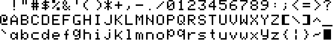

<i>References: <a href="https://archive.org/details/bitsavers_signeticsdcsDataManual_99050280/page/n561/mode/2up">Signetics 2513</a> and <a href="https://archive.org/details/bitsavers_gidataBook_42027291/page/280/mode/2up">GI RO-3-2513</a> datasheets</i>

This is another composite of two character sets, belonging to the 2513/CM2140 (upper case) and 2513/CM3021 (lower case) character generators. The 2513 was a common part that was also produced by other manufacturers like General Instrument. This chip, with the upper-case-only character set, was used by the Apple I and Apple II computers.

	<h4>P</h4>
	<ul>
		<li>Narrow, straight apostrophe <i>'</i> matches double quotation mark <i>"</i></li>
		<li>Effective script <i>a</i></li>
	</ul>

	<h4>M</h4>
	<ul>
		<li>Another abstract at sign <i>@</i></li>
		<li>Wide and bold square brackets <i>[ ]</i></li>
		<li>Poorly constructed <i>k</i></li>
		<li>Very low central terminal of <i>w</i></li>
	</ul>

	<h4>I</h4>
	<ul>
		<li>Very narrow <i>f t</i></li>
		<li>Flat curves of <i>h n r u y</i></li>
	</ul>

<h3>National Semiconductor DM8678</h3>

<i>Reference: <a href="https://archive.org/details/bitsavers_nationaldaMemoryDatabook_43572148/page/n365/mode/2up">DM8678 datasheet</a></i>

This is also a composite of character sets, from the DM8678CAB (upper case) and DM8678CAH (lower case) character generators. The DM8678CAH still contained only 5&times;7 dot matrices for each glyph, but shifted the descending letters <i>g j p q y</i> by two lines during output in order to display them correctly. This has the side-effect of making <i>j</i> appear sunken, with its dot at the waistline of the font.

	<h4>P</h4>
	<ul>
		<li>Clean, consistent lower case alphabet, with the sole exception of <i>j</i></li>
		<li>Excellent question mark <i>?</i></li>
		<li>Consistent, legible <i>b c d g h n p q y</i></li>
	</ul>

	<h4>M</h4>
	<ul>
		<li>Another awkward, top-heavy <i>7</i></li>
		<li>Serifs on upper terminals of <i>G T</i></li>
		<li>Hook of <i>j</i> matches neither <i>g y</i> nor <i>f t</i></li>
	</ul>

	<h4>I</h4>
	<ul>
		<li>Long central leg of <i>M</i></li>
		<li>Short tails of <i>g y</i></li>
		<li>Narrow <i>r</i> (looks more proportional to me; compare with those above and below)</li>
		<li>Shorter <i>t</i> matches conventional typefaces better, but less legible</li>
		<li>Spurless <i>u</i>, <i>a la</i> <a href="https://www.fonts.com/font/linotype/futura">Futura</a></li>
	</ul>

<h3>Mullard SAA5050</h3>

<i>Reference: <a href="https://amigan.yatho.com/saa5050.pdf">SAA5050 datasheet</a></i>

<i>Font replicating this design (with totally smooth diagonals): <a href="https://bjh21.me.uk/bedstead/">Bedstead</a> by Ben Harris</i>

This chip was designed for <a href="https://en.wikipedia.org/wiki/Teletext">Teletext</a> applications and also saw use in home computers such as the BBC Micro. A full nine dots of height are available here, allowing for descenders that properly match the ascenders. The SAA5050 was able to interpolate these glyphs, to produce a 10&times;18 matrix with less jagged diagonals.

	<h4>P</h4>
	<ul>
		<li>Comma and semicolon <i>, ;</i> extend below baseline, taking advantage of space</li>
		<li>Colon and semicolon <i>: ;</i> properly aligned for lower-case text</li>
	</ul>

	<h4>M</h4>
	<ul>
		<li>Odd dollar sign <i>$</i></li>
	</ul>

	<h4>I</h4>
	<ul>
		<li>Narrow hyphen <i>-</i> to differentiate from dash <i>&ndash;</i> in &ldquo;English&rdquo; character set version</li>
		<li>Unusual pointed zero <i>0</i> differentiates from capital <i>O</i> without using a slash, which may have confused general audiences at the time</li>
	</ul>

<h3>Trendcom 200</h3>

<i>Reference: <a href="https://archive.org/details/apple_silentype_operation_and_reference_manual/page/n63/mode/2up">Silentype manual</a></i>

The Trendcom 200 was a thermal printer designed for use with personal computers. It is best known for being rebranded as the Apple Silentype, Apple&rsquo;s first printer. It has one of the more interesting character sets on this list.

	<h4>P</h4>
	<ul>
		<li>Another more reasonably sized asterisk <i>*</i></li>
		<li>Unique and effective bold comma in <i>, ;</i></li>
		<li>Rare and effective tail of <i>R</i></li>
		<li>Non-descending <i>g j p q y</i> fit between baseline and waistline</li>
	</ul>

	<h4>M</h4>
	<ul>
		<li>Short terminals of <i>s</i></li>
	</ul>

	<h4>I</h4>
	<ul>
		<li>Curves of <i>6 9</i> match <i>0 O</i> etc.</li>
		<li>Low crossbar of <i>A</i></li>
		<li>Unique diagonals of <i>M W</i></li>
		<li>Narrow <i>c</i> looks more proportional (but has inconsistent spacing with adjacent letters)</li>
		<li><i>W w</i> are both rotated forms of <i>M m</i>, leading to unique <i>m</i> shape and central terminal of <i>w</i> being longer than usual</li>
	</ul>

<h3>Apple IIe</h3>

<i>Reference: <a href="http://www.kreativekorp.com/software/fonts/apple2.shtml">KreativeKorp &mdash; Ultimate Apple II Font</a></i>

<i>Font replicating this design: <a href="http://www.kreativekorp.com/software/fonts/apple2.shtml">Print Char 21</a> by Rebecca G. Bettencourt</i>

The first 64 glyphs (the first two rows here) are lifted from the Signetics 2513/CM2140 character generator, used in the earliest Apple computers.

The latter 32 glyphs were added to the Apple III (1980) and subsequently the Apple IIe in 1983 (with the crosshatch at 0x7F replacing the Apple logo from the Apple III font). The larger character cells on these systems allowed for descenders on the small letters, if somewhat stunted at only one dot below the baseline.

	<h4>P</h4>
	<ul>
		<li>Another clean, consistent lower-case alphabet, with the exception of <i>g u</i></li>
		<li><i>k</i> 5 dots wide; very open and legible</li>
	</ul>

	<h4>M</h4>
	<ul>
		<li><i>g</i> too round</li>
		<li><i>m w</i> too square</li>
		<li><i>r u</i> do not harmonise with <i>h n y</i></li>
	</ul>

	<h4>I</h4>
	<ul>
		<li>Unusual, effective length of central leg of <i>m</i></li>
		<li>Bold but evenly-curved tilde <i>~</i>; a good solution to keep it two dots high</li>
	</ul>

<h3>Motorola MC6847</h3>
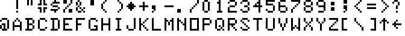

<i>Reference: <a href="https://en.wikipedia.org/wiki/File:Cocobvdg.png">Wikipedia</a></i>

<i>Font replicating this design: <a href="http://www.kreativekorp.com/software/fonts/trs80/#coco">Hot CoCo</a> by Rebecca G. Bettencourt</i>

This video chip, with built-in character generator, was used in the Tandy/Radio Shack TRS-80 Color Computer. It contains a set of negative (or inverse, <i>i.e.</i> white on black) capitals, which there was no need to reproduce here, instead of small letters. Notice that this set is nearly identical to that of the IBM 029 Card Punch seen above.

	<h4>P</h4>

	<h4>M</h4>
	<ul>
		<li>Clumsy-looking <i>4 6 9</i></li>
	</ul>

	<h4>I</h4>
	<ul>
		<li>Diamond in place of asterisk <i>*</i></li>
	</ul>

<h3>Texas Instruments 99/4A</h3>
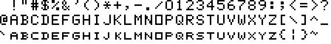

<i>Reference: <a href="http://www.harmlesslion.com/cgi-bin/onesoft.cgi?1">Classic99 emulator</a> (see <a href="research/994A-screenshot.png">screenshot</a>)</i>

The TI 99/4A was another early home computer. Its character set has the rare inclusion of small capitals instead of lower-case letters; this may have been a compromise decision as the character cells are not deep enough for descenders. The small caps are generally well-executed and perfectly match the full capitals.

	<h4>P</h4>
	<ul>
		<li>Effective bold comma and semicolon <i>, ;</i></li>
	</ul>

	<h4>M</h4>
	<ul>
		<li>Regular <i>S</i> in dollar sign <i>$</i>, with another non-protruding stroke</li>
		<li>Narrow <i>j k</i></li>
	</ul>

	<h4>I</h4>
	<ul>
		<li>Non-slashed, full-width zero <i>0</i></li>
	</ul>

<h3>Oric</h3>
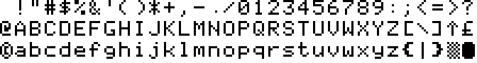

<i>Reference: <a href="https://www.unicode.org/L2/L2019/19025-terminals-prop.pdf">Proposal to add characters from legacy computers and teletext to the UCS</a></i>

The character set of the Oric series of home computers is almost identical to that of the Apple IIe, except for the altered comma, 2, 6, 9, colon, semicolon and square brackets, plus a few special characters in the non-alphanumeric positions.

	<h4>P</h4>

	<h4>M</h4>
	<ul>
		<li>Aggressively-rounded corners of copyright symbol <i>©</i> mean the circle touches the <i>c</i></li>
	</ul>

	<h4>I</h4>
	<ul>
		<li>Long, low stroke on pound sign <i>£</i></li>
	</ul>

<h3>EACA Colour Genie</h3>

<i>Reference: <a href="https://github.com/schnitzeltony/z80/raw/master/cgenie/cgenie.chr">Colour Genie firmware</a> (see <a href="research/Colour-Genie-chargen.png">graphic</a>) </i>

Another, less well-known, home computer from the early 1980s.

	<h4>P</h4>
	<ul>
		<li>Crossbar of <i>f</i> on waistline, as in traditional typefaces</li>
	</ul>

	<h4>M</h4>
	<ul>
		<li>Very long serif of <i>J</i></li>
		<li>Serifs of <i>T Z</i> inconsistent within the font</li>
		<li>Elongated <i>t</i></li>
	</ul>

	<h4>I</h4>
	<ul>
		<li>Unique ampersand <i>&amp;</i></li>
		<li>Serifless <i>1</i></li>
		<li>Descender of <i>f</i></li>
		<li>Effective tilde <i>~</i> (but 6 dots wide is cheating)</li>
	</ul>

<h3>COMX-35</h3>
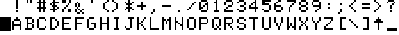

<i>Reference: <a href="https://web.archive.org/web/20180925005902/http://electrickery.xs4all.nl/comp/comx35/comxrom.zip">COMX-35 firmware</a> (see <a href="research/COMX35-chargen.png">graphic</a>)</i>

This obscure home computer has one of the worst character sets I&rsquo;ve seen (the ampersand <i>&amp;</i> really does sit below the baseline; that wasn&rsquo;t a mistake on my part!). There would have been plenty of room for lower-case letters if the set didn't have duplicate glyphs in different colours, multiple variations of the COMX logo and other useless pseudo-graphic characters. What&rsquo;s more, the <a href="https://archive.org/details/bitsavers_rcadataBoorocessorsMemoriesandPeripherals_44881019/page/n295/mode/2up">RCA CDP1870</a> video chip supports character cells 9 dots high, which would have allowed for lower-case with true descenders.

	<h4>P</h4>

	<h4>M</h4>
	<ul>
		<li>Imbalanced number sign <i>#</i></li>
		<li>Drooping upper terminal of <i>2</i></li>
		<li>Extra dots in <i>5 A</i></li>
		<li>Short terminals of <i>9 G</i></li>
	</ul>

	<h4>I</h4>

<h3>Aquarius</h3>
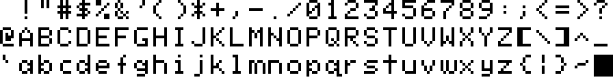

<i>Reference: <a href="http://oldcomputer.info/keep/c/museum/8bit/Aquarius/AqEmu_emulator.zip">Aquarius firmware</a> (see <a href="research/Aquarius-chargen.png">graphic</a>)</i>

The Aquarius computer, manufactured by Radofin, is best known for being briefly sold under the Mattel brand. The first 64 glyphs in this set are identical to those in the upper-case Signetics 2513/CM2140 character generator (except the apostrophe!) and the latter 32 appear to have been derived from the lower-case 2513/CM3021 with some modifications.

	<h4>P</h4>

	<h4>M</h4>
	<ul>
		<li>Uneven arms on <i>k</i></li>
		<li><i>m w</i> 6 dots wide and uneven</li>
		<li>Short descenders of <i>p q</i></li>
		<li>Square <i>y</i></li>
	</ul>

	<h4>I</h4>
	<ul>
		<li>Cruciform <i>t</i></li>
	</ul>

<h3>Commodore MPS-803</h3>
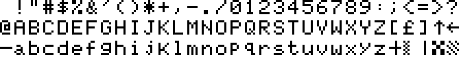

<i>Reference: <a href="research/MPS-803-sample.png">printout from my MPS-803</a></i>

The MPS-803 was a dot-matrix printer designed for use with Commodore home computers. Being an 8-bit Commodore device, its built-in character set does not adhere to the ASCII standard, so this image has been rearranged for presentation here.

This has one of the cleanest, most consistent capital alphabets yet examined, but the small alphabet suffers from numerous quirks.

	<h4>P</h4>
	<ul>
		<li>Round <i>A G</i> make for consistent look</li>
		<li>Unusual and effective <i>y</i> based on <i>v</i> shape, as in conventional typefaces</li>
	</ul>

	<h4>M</h4>
	<ul>
		<li>Narrow <i>p q</i></li>
		<li>Uneven <i>s</i></li>
	</ul>

	<h4>I</h4>
	<ul>
		<li>Tail on <i>a</i></li>
	</ul>

<h3>BASIC Level III (Sega SC-3000)</h3>
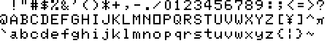

<i>Reference: <a href="http://www.play-sc-3000.com/cart.php?Game=BASIC">SC-3000 Survivors online emulator</a> (see <a href="research/SC-3000-screenshot.png">screenshot</a>)</i>

The SC-3000 was a computer version of Sega&rsquo;s first game console, the SG-1000. Like the SG-1000 but rarely for home computers, it has no built-in ROM for firmware, instead relying on plug-in cartridges. This character set belongs to the <a href="https://en.wikipedia.org/wiki/BASIC">BASIC</a>  Level III cartridge.

	<h4>P</h4>
	<ul>
		<li>Well-executed yen sign <i>&yen;</i></li>
		<li>Effective Greek letter pi <i>&pi;</i></li>
	</ul>

	<h4>M</h4>
	<ul>
		<li>Serif and weak diagonal on <i>7</i></li>
		<li>Drooping upper terminal on question mark <i>?</i></li>
		<li>Square <i>a</i></li>
		<li>Wide crossbars on <i>f t</i></li>
	</ul>

	<h4>I</h4>
	<ul>
		<li>Chunky <i>4</i> is highly legible</li>
		<li>Rounded <i>a</i> within at sign <i>@</i></li>
		<li>Short central terminal of <i>W</i></li>
	</ul>

<h3>MSX</h3>

<i>Reference: <a href="http://www.ateijelo.com/blog/2016/09/13/making-an-msx-font">La Nueva Escuela &mdash; Making an MSX font</a></i>

<i>Font replicating this design: <a href="http://www.ateijelo.com/blog/2016/09/13/making-an-msx-font">MSX Screen 0</a> by Andy Teijelo</i>

Inspired by successful industry standards like VHS and disappointed in the Wild-West fractured home computer market, several (mostly Japanese) manufacturers adopted a common 8-bit computer standard, MSX. The full character set is similar to <a href="https://en.wikipedia.org/wiki/Code_page_437">that of the IBM PC</a>, with the glyphs redesigned to fit the TMS9918 video chip&rsquo;s text mode.

	<h4>P</h4>

	<h4>M</h4>
	<ul>
		<li>Poorly-executed ampersand <i>&amp;</i></li>
		<li>Low slashes <i>/ \</i></li>
		<li>Angular <i>5</i></li>
		<li>Serif and odd diagonal on <i>7</i></li>
		<li>Centred stem of <i>f</i> leaves little room for hook</li>
		<li>Crowded dots in <i>g p q</i></li>
		<li>Extra dot in middle of <i>s</i></li>
	</ul>

	<h4>I</h4>
	<ul>
		<li>Bold less- and greater-than signs <i>&lt; &gt;</i></li>
		<li><i>D</i> combines both legibility enhancements</li>
		<li>Tail on <i>u</i></li>
	</ul>

<h3>Elektronika BK-0010</h3>
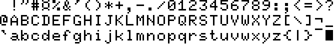

<i>Reference: <a href="http://www.bk001x.ru/index/ehmuljatory_bk001x/0-4">BK Back to Life emulator</a> (<a href="research/BK-0010-screenshot.png">see screenshot</a>)</i>

This is a rare example of a home computer from the Soviet Union. Overall, it has one of the nicest fonts on this list, with relatively few foibles. It also contains glyphs for the Cyrillic (Russian) alphabet, of course, so it can be a useful example for extending my font later.

	<h4>P</h4>
	<ul>
		<li>7-dot high version of the angular <i>y</i></li>
	</ul>

	<h4>M</h4>
	<ul>
		<li>Asymmetric quotation marks <i>" '</i></li>
		<li>Unique and ugly at sign <i>@</i></li>
	</ul>

	<h4>I</h4>
	<ul>
		<li>Large currency sign <i>&curren;</i></li>
		<li>Rarely, <i>B D</i> do not match</li>
		<li>Extra-pointy curly brackets <i>{ }</i></li>
	</ul>

<h3>Samsung SPC-1000</h3>

<i>Reference: <a href="https://en.wikipedia.org/wiki/File:SPC-1000TEXT.GIF">Wikipedia</a></i>

The SPC-1000 was Samsung&rsquo;s first personal computer. It used the AMI S68047 video chip, similar to the Motorola 6847 and evidently with a very similar built-in character generator ROM. The latter 32 glyphs here are unique to the SPC-1000, however. Note that the relative letter spacing has been altered in the graphic above to accommodate a few 7-dot wide glyphs; this system used 8&times;12 character cells.

	<h4>P</h4>

	<h4>M</h4>
	<ul>
		<li>Long upper terminal and ugly tail of <i>a</i></li>
	</ul>

	<h4>I</h4>
	<ul>
		<li>Won sign <i>₩</i> uses width to advantage</li>
	</ul>

<h3>Motorola MC6847T1</h3>

<i>Reference: <a href="https://en.wikipedia.org/wiki/File:Coco2bvdg_lc.png">Wikipedia</a></i>

This updated video chip was used in the late-model Tandy/Radio Shack TRS-80 Color Computer 2. It now contains a lower-case alphabet, with true descenders. Some of the unusual glyph designs have been cleaned up in this version, although some have also been made worse.

	<h4>P</h4>

	<h4>M</h4>
	<ul>
		<li>Another asterisk <i>*</i> with uneven weight</li>
		<li>Missing dot in centre of <i>3</i></li>
		<li>At sign <i>@</i> unique and ugly</li>
		<li><i>j y</i> shorter than other descending letters</li>
		<li>Humpless <i>m</i></li>
	</ul>

	<h4>I</h4>

<h3>Sega barcodes</h3>
<figure class="font" style="max-width: 210px;">
	

<i>References:  <a href="https://www.smspower.org/Scans/AlteredBeast-SMS-AU">Altered Beast</a> and <a href="https://www.smspower.org/Scans/BlackBelt-SMS-AU">Black Belt</a> case inserts</i>

These numerals were found alongside the barcodes on some Sega Master System games. They contain some interesting features that I haven&rsquo;t seen anywhere else. Some of those may have been inspired by the typeface <a href="https://en.wikipedia.org/wiki/OCR-B">OCR-B</a>, which is normally used on <a href="https://en.wikipedia.org/wiki/International_Article_Number">EAN</a> and <a href="https://en.wikipedia.org/wiki/Universal_Product_Code">UPC</a> barcodes; that would explain the designs of the digits 1, 3, 4, 6 and 9 (but not 2, 5 or 7).

	<h4>P</h4>
	<ul>
		<li>Effective, serifless <i>1</i></li>
		<li>Well-executed flat-topped <i>3</i> (finally!)</li>
		<li>Open counter of <i>4</i> is attractive and legible</li>
	</ul>

	<h4>M</h4>
	<ul>
		<li>Odd diagonal of <i>2</i></li>
	</ul>

	<h4>I</h4>
	<ul>
		<li>Short tails of <i>6 9</i> are legible but appear somewhat imbalanced</li>
	</ul>

<h3>Hitachi HD44780U</h3>

<i>Reference: <a href="https://www.sparkfun.com/datasheets/LCD/HD44780.pdf">HD44780U Datasheet</a></i>

This LCD controller, dating back to the 1980s, has been widely used in character LCDs. Particularly popular in hobbyist applications and commercial devices of low-volume production, there are hundreds of these modules available from dozens of manufacturers. Nowadays, such devices usually emulate the HD44780U&rsquo;s behaviour and character ROM. Of the character LCDs available on Mouser at the time of writing (that list the glyph patterns in the datasheet, like <a href="https://au.mouser.com/datasheet/2/271/Microtips-04-17-2018-NMTC-S20200XRGHS-10B-1369867.pdf">this example</a>), all appear to use nearly identical glyph designs, usually varying by only a few dots here and there. They are likely derivatives of each other, with differences probably due to errors in manual transcription. Shown here is the A00 ROM, which provides the option of true descenders (and very deep ones too, at 3 dots below the baseline).

	<h4>P</h4>

	<h4>M</h4>
	<ul>
		<li>Cluttered yen sign <i>&yen;</i></li>
		<li>Uneven <i>c</i></li>
	</ul>

	<h4>I</h4>
	<ul>
		<li>Very deep descenders of <i>g j p q y</i></li>
	</ul>

<h3>Terminal (Microsoft Windows)</h3>
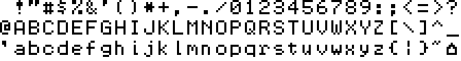

<i>Reference: app850.fon (system font file)</i>

This font, aptly named Terminal, is used when a Command Prompt window is set to use the 6&times;8 raster font (those being the full character cell dimensions, including the gaps around the 5&times;7 glyphs). It dates back at least as far as 1992, in Windows 3.1&rsquo;s DOSAPP.FON. It has quite a number of unusual features compared to the other fonts in this list. The design strikes me as something that was adapted from larger dimensions (the file does contain fonts of various sizes, possibly lending some credence to this idea), which may explain the unconventional design, odd proportions and inconsistent weight of certain glyphs.

	<h4>P</h4>
	<ul>
	</ul>

	<h4>M</h4>
	<ul>
		<li>Wide spacing in equals sign <i>=</i></li>
		<li>Narrow <i>Z h k n u x y z ~</i></li>
		<li>Only one serif at bottom right of <i>i l</i> but regular serif on <i>j</i></li>
		<li>Serifs on <i>r</i></li>
		<li>Uneven weight of <i>w y</i></li>
	</ul>

	<h4>I</h4>
	<ul>
		<li>Bold exclamation mark <i>!</i></li>
		<li>Short number sign <i>#</i></li>
		<li>Diagonal stroke in dollar sign <i>$</i></li>
		<li>Narrow round brackets <i>( )</i></li>
		<li>Small, bold asterisk <i>*</i></li>
		<li>Another style of bold comma <i>,</i></li>
		<li>High central terminal in <i>W</i></li>
		<li>No diagonals in <i>x</i></li>
		<li>Extra dot in centre of curly brackets <i>{ }</i></li>
	</ul>

<h3>FF Dot Matrix Two</h3>
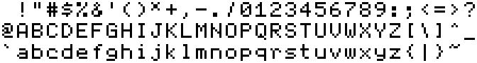

<i>Reference: <a href="https://www.myfonts.com/collections/ff-dot-matrix-font-fontfont?tab=glyphs">MyFonts &mdash; FF Dot Matrix</a></i>

	<h4>P</h4>
	<ul>
		<li>Excellent slash and backslash <i>/ \</i> use the full height without appearing lumpy or wavy</li>
	</ul>

	<h4>M</h4>
	<ul>
		<li>Another ugly ampersand <i>&amp;</i><li>
		<li>Mismatched comma and full stop <i>, .</i></li>
		<li>Asymmetrical tilde on <i>~</i></li>
	</ul>

	<h4>I</h4>
	<ul>
		<li>Small, cross-shaped asterisk <i>*</i></li>
		<li>At sign <i>@</i> uses broken ring to good effect</li>
		<li>Descender of <i>Q</i></li>
	</ul>

<h3>Fairfax</h3>
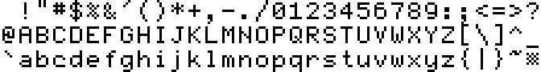

<i>Reference: <a href="http://www.kreativekorp.com/software/fonts/fairfax.shtml">KreativeKorp &mdash; Fairfax</a></i>

This open-source font by Rebecca G. Bettencourt was created for the stated purposes of coding and plain text editing, and has a wide Unicode coverage with support for some constructed scripts in the Unicode Private Use Area. Similarly to the font I wish to create, it is distributed as an outline font in TrueType format, having been converted from bitmaps using <a href="https://github.com/kreativekorp/bitsnpicas">custom software</a>.

Fairfax has the best lower-case <i>b d g p q</i> that I have seen in any 5&times;7 font. It is the only design examined here that has the conventional bowl shapes for these letters (see the National Semiconductor MM4240 section above). While still being restricted to 5 dots of width, some glyphs enjoy a much taller dot matrix, such as the quotation marks, slashes and brackets. This affords the font a more modern feel, unlike anything derived from one of the &ldquo;classical&rdquo; 5&times;7 fonts above.

	<h4>P</h4>
	<ul>
		<li>Large dollar sign <i>$</i> with protruding stroke</li>
		<li>Tall brackets, slashes, vertical line <i>() [] {} / \ |</i></li>
		<li>Gentle curve of <i>7</i></li>
		<li>Well-executed 5&times;5 less- and greater-than signs <i>&lt; &gt;</i> like rotated <i>v</i></li>
		<li>Narrow curly brackets <i>{ }</i> much more effective with this height</li>
	</ul>

	<h4>M</h4>
	<ul>
		<li>Per cent sign <i>%</i> contains real circles instead of dots, but this harms its clarity</li>
	</ul>

	<h4>I</h4>
	<ul>
		<li>Quotation marks <i>" '</i> raised above cap line</li>
		<li>Small, raised number sign <i>#</i></li>
		<li>Asterisk <i>*</i> raised but with usual shape</li>
		<li>Flat upper serif of <i>1</i></li>
		<li>Unusual <i>6 9</i></li>
		<li>Variation of the abstract at sign <i>@</i> manages to contain recognisable <i>a</i></li>
		<li>Asymmetric <i>c</i></li>
	</ul>

<h3>PixelMix</h3>
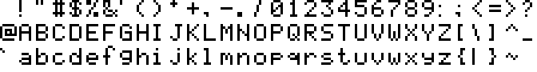

<i>Reference: pixelmix.ttf via <a href="https://www.dafont.com/pixelmix.font">DaFont</a></i>

This is a popular 5&times;7 dot matrix font by Andrew Tyler, freely available online for personal use, with over 400,000 downloads on DaFont at the time of writing. The design appears to be based on the A02 ROM of the Hitachi HD44780U, with most of the alphanumeric characters matching it. While the small letters are therefore a bit wonky and inconsistent, it does have the very effective slash and backslash seen in FF Dot Matrix above.

	<h4>P</h4>
	<ul>
		<li>Ideal size and shape of grave accent <i>`</i></li>
	</ul>

	<h4>M</h4>
	<ul>
		<li>Wide and ugly ampersand <i>&amp;</i></li>
		<li>Plus-shaped asterisk <i>*</i></li>
		<li>Slightly narrow, lop-sided question mark <i>?</i></li>
		<li>Extra wide at sign <i>@</i></li>
		<li>Extra tall <i>f</i></li>
		<li><i>g</i> rises above waistline</li>
	</ul>

	<h4>I</h4>
	<ul>
		<li>Wide stroke spacing in number sign <i>#</i></li>
		<li>Right-angled comma <i>, ;</i></li>
		<li>Square corners of curly brackets <i>{ }</i></li>
	</ul>

<h3>5by7</h3>

<i>Reference: 5by7.ttf via <a href="http://www.peter-wiegel.de/5by7.html">peter-wiegel.de</a></i>

This open-source font by Peter Wiegel was inspired by his first font project: modifying the character set of a laboratory instrument to support German umlauts. Although the glyphs are strictly limited to a 5&times;7 matrix, it is a proportional font, so narrow glyphs have only one dot of spacing.

	<h4>P</h4>
	<ul>
	</ul>

	<h4>M</h4>
	<ul>
		<li>Another unusual ampersand <i>&amp;</i></li>
		<li>Asterisk <i>*</i> is a square</li>
	</ul>

	<h4>I</h4>
	<ul>
		<li>Bold exclamation mark <i>!</i></li>
		<li>Different shape of non-descending <i>y</i></li>
	</ul>

<h3>Minecraft</h3>

<i>Reference: ascii.png (game texture file)</i>

Although this is by far the most stylised font shown here, I felt it was worth examining since it belongs to the best-selling video game of all time; countless words in this font have been read by hundreds of millions of people around the world. This makes it a significant design with wide recognition, especially amongst young people.

In monospaced fonts like those above (except PixelMix), it was normal to include serifs on <i>1 I i l</i> for extra width. The Minecraft font is proportionally spaced, however, so many glyphs are much wider or narrower than usual. Additionally, the proportions of many glyphs (like the small punctuation marks, small raised asterisk, full-height slashes, etc.) are unusual for 5&times;7 dot matrix fonts, but perfectly normal for conventional typefaces. These features all help to give the Minecraft font a more contemporary feel.

	<h4>P</h4>

	<h4>M</h4>
	<ul>
		<li>Yet another poorly-executed ampersand <i>&</i></li>
		<li>Small, raised asterisk <i>*</i> less recognisable</li>
		<li>Wide base of <i>1</i></li>
		<li>Serif on <i>2</i></li>
		<li>Tailless <i>4</i></li>
		<li>Long tails of <i>g y</i></li>
		<li>Square corner of <i>w</i></li>
	</ul>

	<h4>I</h4>
	<ul>
		<li>Narrow dots in percent sign <i>%</i></li>
		<li>Larger at sign <i>@</i> still an abstract squiggle</li>
		<li>High-waisted capitals <i>A B E F G H K P R S X Y</i></li>
		<li>Stroke of <i>Q</i> only extends outwards</li>
		<li>Vertical tail of <i>R</i></li>
		<li>Inconsistent terminals of <i>S</i></li>
		<li>Serifless <i>i j l</i></li>
	</ul>

<h3 style="text-align: left;">Beyond ASCII</h3>

There has long been more to computer fonts than the 95 printable ASCII characters. Some of the fonts examined above contained accented letters and other special characters, which we will now explore further. Where necessary, I have rearranged the glyphs to match the order of <a href="https://en.wikipedia.org/wiki/ISO/IEC_8859-1">ISO&#x2011;8859&#x2011;1</a> (and thereby Unicode's <a href="https://www.unicode.org/charts/PDF/U0080.pdf">Latin&#x2011;1 Supplement</a> block) to make comparison easier.</strong>

See how the diacritical marks are very large, compared to conventional typefaces, owing to the number of dots required to define them.

<h4>Mullard SAA5050</h4>
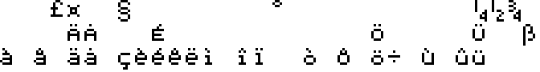

This set is a composite of the various language versions of the SAA5050 that were offered.

	<h4>P</h4>
	<ul>
		<li>Effective pound sign <i>£</i></li>
		<li>Attractive section sign <i>§</i> is clearly based on <i>S</i></li>
		<li>Wide degree sign <i>°</i> keeps counter open, even after application of the SAA5050&rsquo;s diagonal-smoothing algorithm</li>
		<li>No bar in fractions <i>½ ¼ ¾</i> to maximise legibility at this low resolution</li>
		<li>Attractive sharp s <i>ß</i></li>
		<li>Distinguished, right-angled cedilla on <i>ç</i></li>
	</ul>

	<h4>M</h4>
	<ul>
		<li>Diacritics of <i>à â è é ê ô</i> touching base glyphs</li>
	</ul>

	<h4>I</h4>
	<ul>
		<li>Square currency sign <i>¤</i></li>
		<li>Shorter letters <i>Ä Å É Ö Ü ì î ò û ü</i> to fit diacritical marks</li>
		<li>Single dot for ring of <i>Å å</i></li>
	</ul>

<h4>Level III BASIC (Sega SC-3000)</h4>

	<h4>P</h4>

	<h4>M</h4>
	<ul>
		<li>Ugly pound sign <i>£</i></li>
		<li>No right downstroke on micro sign/mu <i>µ</i></li>
		<li>Inverted question mark <i>¿</i> does not match regular one</li>
		<li>Acute and grave accents on <i>À Á</i> are droopy</li>
		<li>Misaligned diacritics on <i>È É Ê Ë Ì Í Î Ò Ó Û</i></li>
	</ul>

	<h4>I</h4>
	<ul>
		<li>Inverted exclamation mark <i>&iexcl;</i> on baseline, suits all-capitals text</li>
		<li>Diagonal cedilla on <i>Ç</i></li>
	</ul>

<h4>MSX</h4>
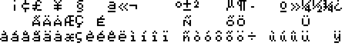

	<h4>P</h4>
	<ul>
	</ul>

	<h4>M</h4>
	<ul>
		<li>Broken stroke of cent sign <i>¢</i> differs from <i>$</i></li>
		<li>Another unsuccessful attempt at a calligraphic pound sign <i>£</i></li>
		<li>Ordinal indicators ª º have different widths</li>
		<li>Narrow counter of micro sign/mu <i>µ</i></li>
		<li>Fractions <i>¼ ½ ¾</i> inconsistent and cramped</li>
		<li>Width of <i>ü</i> inconsistent with <i>ù ú û</i></li>
	</ul>

	<h4>I</h4>
	<ul>
		<li>Prominent crossbars of yen sign <i>¥</i></li>
		<li>Large central section of narrow section sign <i>§</i></li>
		<li>Curved cedilla on <i>ç</i></li>
		<li><i>Õ õ</i> differ only in width</li>
	</ul>

<h4>Hitachi HD44780U</h4>
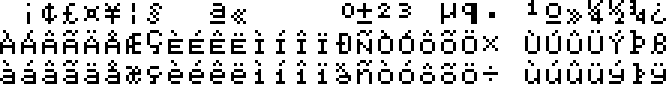

These glyphs are from the A02 ROM version of the HD44780U, which lacks descenders but does contain most of the ISO&#x2011;8859&#x2011;1 character set.

	<h4>P</h4>
	<ul>
		<li>Well-executed, calligraphic pound sign <i>£</i></li>
		<li>Micro sign <i>&micro;</i> matches <i>u</i>, as in most conventional sans-serif typefaces</li>
	</ul>

	<h4>M</h4>
	<ul>
		<li>Awkward section sign <i>§</i></li>
		<li>Ugly pilcrow/paragraph sign <i>&para;</i></li>
		<li>Serifed thorn <i>&THORN; &thorn;</i></li>
		<li>Tall <i>&aelig;</i></li>
		<li><i>&igrave; &iacute; &icirc; &iuml;</i> do not match <i>i</i></li>
		<li>Ugly (but at least clear) eth <i>&eth;</i></li>
	</ul>

	<h4>I</h4>
	<ul>
		<li>Very large degree sign <i>&deg;</i></li>
	</ul>

<h4>Command Prompt (Microsoft Windows)</h4>

These glyphs come from the system file app850.fon, (presumably named for <a href="https://en.wikipedia.org/wiki/Code_page_850">Code Page 850</a>) as it contains all the characters of ISO&#x2011;8859&#x2011;1.

	<h4>P</h4>
	<ul>
		<li>Effective copyright symbol <i>&copy;</i></li>
	</ul>

	<h4>M</h4>
	<ul>
		<li>Small superscript <i>&sup3;</i> is barely legible</li>
		<li>Horizontal grave and acute accents <i>&Agrave; &Aacute; etc.</i> are only recognisable in context</li>
		<li>Tilde <i>&Ntilde; etc.</i> looks more like double acute accent</li>
		<li>Ugly <i>&Oslash; &oslash;</i></li>
		<li>Greek delta <i>&delta;</i> in place of eth <i>&eth;</i></li>
	</ul>

	<h4>I</h4>
	<ul>
		<li>Square ring of <i>&Aring; &aring;</i></li>
		<li>Rotationally symmetric <i>&aelig;</i></li>
	</ul>

<h4>Fairfax</h4>
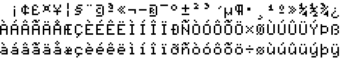

This font employs full-height accented capitals, with separate (not conjoined) diacritical marks. This greatly enhances its consistency, legibility and modernity, not to mention its suitability for writing languages other than English.

	<h4>P</h4>
	<ul>
		<li>Perfectly consistent and clear letters (with the only exceptions of the awkward <i>&Oslash; &eth;</i>)</li>
	</ul>

	<h4>M</h4>
	<ul>
		<li>Very angular micro sign/mu <i>&micro;</i></li>
		<li>Extra dot near centre of pilcrow/paragraph sign <i>&para;</i></li>
	</ul>

	<h4>I</h4>
	<ul>
		<li>Unique, well-executed pound sign <i>&pound;</i></li>
		<li>Single stroke in yen sign <i>&yen;</i></li>
		<li>Unusual but effective section sign <i>&sect;</i></li>
		<li>Incomplete circles in copyright and registered trademark symbols <i>&copy; &reg;</i> to remain 5-dots wide</li>
	</ul>

<h4>Minecraft</h4>
<figure class="font" style="max-width: 864px;">
	

This font makes use of wider glyphs as well as taller ones, giving it the largest character cells shown on this page.

	<h4>P</h4>
	<ul>
		<li>Well-executed eth <i>&eth;</i></li>
	</ul>

	<h4>M</h4>
	<ul>
	</ul>

	<h4>I</h4>
	<ul>
	</ul>

<h3 style="text-align: left;">My past designs</h3>

I created my first dot-matrix font in 2013, using pencil and graph paper. I then scanned and digitised it with the help of Microsoft Paint. Ever since then, tinkering with such designs has been an occasional pastime for me. Initially, I did this with relatively little outside inspiration, but over time my work lost some originality in favour of more conventional (and usually better) design choices. Most were not based on 5&times;7 dot matrices, but below are four selected designs that were.

There is little to say about these designs that hasn&rsquo;t already been mentioned above, but I will note some of the more interesting features:

<h4>Untitled, 2014</h4>
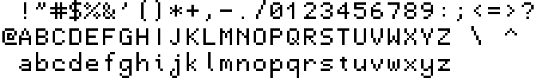

This was one of my earliest efforts, based on the 7&times;7 font I created first. The long ascenders and descenders, number <i>1</i>, capital letters <i>A I S V Y</i> and small <i>j</i> are all unusual designs. The small letters almost have the traditionally correct shapes, if not for <i>d</i>.

<h4>Untitled, 2014</h4>

This is an improved version of the previous design, now based on smaller character cells. Here, I had arrived upon my favourite design of the slashes <i>/ \</i>, which admittedly doesn&rsquo;t work very well in the per cent sign <i>%</i>. There is also a unique design for the capital <i>G</i> and the rare variant of <i>R</i>, which I must have created independently. I remember adding the extra curves to <i>S</i> after seeing other examples and realising my previous effort was rather unusual.

<h4>Untitled, 2018</h4>
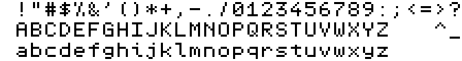

This design was created from scratch, without reference to any previous efforts. All the alphanumeric characters here are strictly 5 dots wide, including <i>1 I i j l</i>. We can see the introduction of my favourite design for the question mark <i>?</i>, and the capital <i>Y</i> no longer resembles <i>V</i>.

<h4>QS Matrix 1.0, 2019</h4>
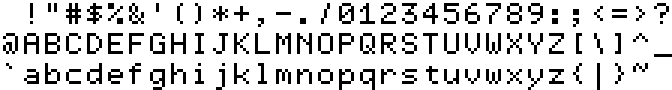

<a href="http://friedorange.xyz/quikscript/myfonts/QSMatrix.zip">This design</a> was created primarily as a font for the Quikscript and Shavian alphabets, hence the name QS Matrix. The design may have been based on the previous one, as it shares many similarities. The small <i>y</i> is unusual, and was inspired by the one from the Commodore MPS-803 printer as seen above.

<a href="http://friedorange.xyz/quikscript/myfonts.html">Version 2</a> of this font was made after beginning the study documented here. As a result, I decided to alter some glyphs to make the font appear a little more generic.

<h2>Results</h2>

As discussed in the README for this repository, I attempted strike a balance between these four principles when designing my own 5&times;7 font:

<ul>
	<li>authenticity</li>
	<li>quirkiness</li>
	<li>consistency</li>
	<li>sound design</li>
</ul>

The former two qualities are often in conflict with the latter two; for example, the crossbar of small <i>f</i> should ideally be at the waistline, but almost never is in the fonts seen above. Here, I would make the crossbar lower in the interests of authenticity. Doing so also adds a degree of quirkiness, which I think is desirable in such a font.

Of course, there is really a fifth, hidden criterion for choosing these designs: personal taste. Despite attempts to remain impartial, some of my preferences &#x2014; even dating back to my earliest, inexperienced designs &#x2014; have sneaked into this project. Most notable are the rare less-than and greater-than signs <i> &lt; &gt;</i> and question mark <i>?</i>, and the (possibly) unique small <i>m</i>. To be fair, these instances can actually be justified under the sound design principle, as sometimes the most common variant seen above just isn&rsquo;t very good (in my opinion). But perhaps it is only right that I do leave some kind of mark here, rather than creating the most generic design possible.

So, after seeing a dizzying array of 5&times;7 dot matrix fonts from past and present, it is finally time to design my new font. I consider the following glyphs to be easy choices, because the overwhelming majority of existing fonts use them or because they have no reasonable alternatives:

<figure class="font" style="max-width: 768px;">
	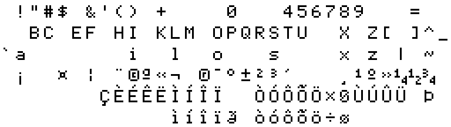

While this image only spans the range of the ISO&#x2011;8859&#x2011;1 character set, I plan for the font to support both <a href="https://github.com/adobe-type-tools/adobe-latin-charsets">Adobe Latin 4</a> and <del><a href="https://github.com/googlefonts/glyphsets/tree/main/Lib/glyphsets/encodings/GF%20Glyph%20Sets">Google Fonts Latin Expert</a></del> <a href="https://github.com/googlefonts/glyphsets/tree/main/GF_glyphsets/Latin">Google Fonts Latin Level 4</a>, which have much wider Unicode coverage. Also note that I have had to extend the character cells to 7 dots wide in order to fit the vulgar fractions <i>¼ ½ ¾</i>, and the copyright and registered trademark symbols &copy; &reg;, which require 6 dots of width. It is possible to make those fractions only 5 dots wide, as in the Mullard SAA5050 seen above, but that scheme would not work for the others like <i>⅔ ⅜ ⅝ ⅞</i>.

To fill in the gaps of the above figure, I judged which option would best suit my intended aesthetic for the font, based on the four principles mentioned at the start of this section and visual trials of different variations. I consider many of these options to be equally good. In fact, in some cases my real personal preference ended up as the second choice, since I ultimately decided a different option was more suitable for the font as a whole. The following table lists the glyphs I chose from, in decreasing order of preference (<i>i.e.</i> with my final decision leftmost):

<table>
<tr>
	<th>Options</th>
	<th>Rationale</th>
</tr>
<tr>
	<td>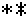</td>
	<td>Option 2 is too big, so much so that it might confuse contemporary audiences.</td>
</tr>
<tr>
	<td>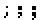</td>
	<td>Tests proved the bold punctuation marks don&rsquo;t suit the font as a whole. This choice also applies to others like the comma, colon, etc.</td>
</tr>
<tr>
	<td></td>
	<td>The 3-dot hyphen suits texts better and the 5-dot variant makes a better minus sign. Since this Unicode character does double duty, the 4-dot variant is a compromise.</td>
</tr>
<tr>
	<td></td>
	<td>I am fond of Option 2, but it is so rare that the authenticity principle dictated Option 1 in this case.</td>
</tr>
<tr>
	<td></td>
	<td>A more understated design and far more common.</td>
</tr>
<tr>
	<td>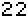</td>
	<td>Chosen as it appears less sharp and angular, better fitting with the other digits.</td>
</tr>
<tr>
	<td>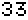</td>
	<td>Option 2 is more legible and better distinguished from <i>8</i> and the Cyrillic letter <i>З</i>, but probably too rare to use here.</td>
</tr>
<tr>
	<td>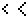</td>
	<td>The smaller less-than and greater-than signs are a better fit with both the other mathematical operators and conventional typefaces.</td>
</tr>
<tr>
	<td></td>
	<td>Option 3 lacks the point of inflection that I think question marks should have and Option 2 has a cramped upper curve, failing the sound design principle.</td>
</tr>
<tr>
	<td>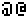</td>
	<td>Option 1 visibly contains an <i>a</i>, as at signs probably should.</td>
</tr>
<tr>
	<td></td>
	<td>Option 2 here (as with <i>D G</i> below) is more consistent with the other capitals and arguably a more sound design. I chose Option 1 to inject a little more quirkiness to the font.</td>
</tr>
<tr>
	<td></td>
	<td>Reasons as noted for <i>A</i> above. Option 1 is also much more legible.</td>
</tr>
<tr>
	<td></td>
	<td>Reasons as noted for <i>A</i> above. Options 3 and 4 are perhaps a little too exaggerated for this font.</td>
</tr>
<tr>
	<td></td>
	<td>Chosen for consistency with capital <i>I</i>.</td>
</tr>
<tr>
	<td>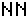</td>
	<td>Both have imperfect diagonals. I&rsquo;ve changed my mind on this one over the years, but at the moment Option 2 looks stranger to me.</td>
</tr>
<tr>
	<td>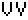</td>
	<td>Less legible than Option 2, but chosen for consistency with <i>A</i> and <i>v</i>.</td>
</tr>
<tr>
	<td>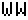</td>
	<td>Also less legible than Option 2, but chosen for consistency with <i>V v w</i></td>
</tr>
<tr>
	<td>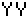</td>
	<td>The more common design, which I also feel looks slightly nicer.</td>
</tr>
<tr>
	<td>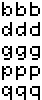</td>
	<td>A tough decision. Option 3 matches option 2 of <i>h n r u</i>, which I don&rsquo;t like very much. Option 2 is the most well-designed; perhaps <i>too</i> well-designed for this font. Therefore, I chose Option 1 for being suitably quirky, yet functional.</td>
</tr>
<tr>
	<td></td>
	<td>Although Options 2 and 3 are more legible, I prefer glyphs that are 5 dots wide and Option 3 is unattractive.</td>
</tr>
<tr>
	<td>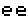</td>
	<td>The shorter terminal makes the letter look clearer to me.</td>
</tr>
<tr>
	<td>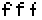</td>
	<td>Is 5 dots wide, more open and legible, more authentic, and the hook is consistent with <i>j t</i>.</td>
</tr>
<tr>
	<td>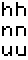</td>
	<td>I much prefer the look of option 1. It is also consistent with <i>b d</i> etc.</td>
</tr>
<tr>
	<td>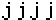</td>
	<td>The hook is consistent with <i>f t</i> and the serif is consistent with <i>i</i>.</td>
</tr>
<tr>
	<td></td>
	<td>Is 5 dots wide and more open and legible.</td>
</tr>
<tr>
	<td></td>
	<td>This feels most natural to me and is a compromise between the other, equally common, options.</td>
</tr>
<tr>
	<td></td>
	<td>Option 2 would match Option 2 of <i>b h</i> etc.</td>
</tr>
<tr>
	<td>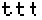</td>
	<td>Similar reasons as for <i>f</i>.</td>
</tr>
<tr>
	<td></td>
	<td>Option 2 looks like the two sides are curved, rather than diagonal. Option 1 has straight sides but clear diagonals near the bottom.</td>
</tr>
<tr>
	<td></td>
	<td>Chosen for consistency with <i>m</i>.</td>
</tr>
<tr>
	<td>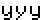</td>
	<td>Another tough decision. I like option 2 and its effect on the typographic colour of text in the font, but it is rather rare and other people don&rsquo;t seem to like it as much.</td>
</tr>
<tr>
	<td>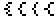</td>
	<td>Option 1 is highly exaggerated, but I find the others too hard to recognise as curly brackets.</td>
</tr>
<tr>
	<td>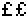</td>
	<td>A more understated design that is more consistent with the rest of the font.</td>
</tr>
<tr>
	<td>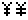</td>
	<td>Same reasons as for the pound sign <i>&pound;</i> above.</td>
</tr>
<tr>
	<td></td>
	<td>Chosen for consistency with the pilcrow/paragraph sign &para;.</td>
</tr>
<tr>
	<td></td>
	<td>Option 3 has no separation between the pair and Option 2 is too stylistic.</td>
</tr>
<tr>
	<td></td>
	<td>A more traditional Greek shape, and unrelated to the design of <i>u</i> as it technically should be.</td>
</tr>
<tr>
	<td>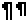</td>
	<td>The longer version has better visual proportions.</td>
</tr>
<tr>
	<td>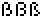</td>
	<td>I feel that Option 1 best suits the overall character of the font.</td>
</tr>
</table>

<footer>

Text is copyright &copy; 2022, Brad Neil. All images on this page are made available under the <a href="https://creativecommons.org/publicdomain/zero/1.0/">Creative Commons Zero license</a>.
</footer>

</body>
</html>